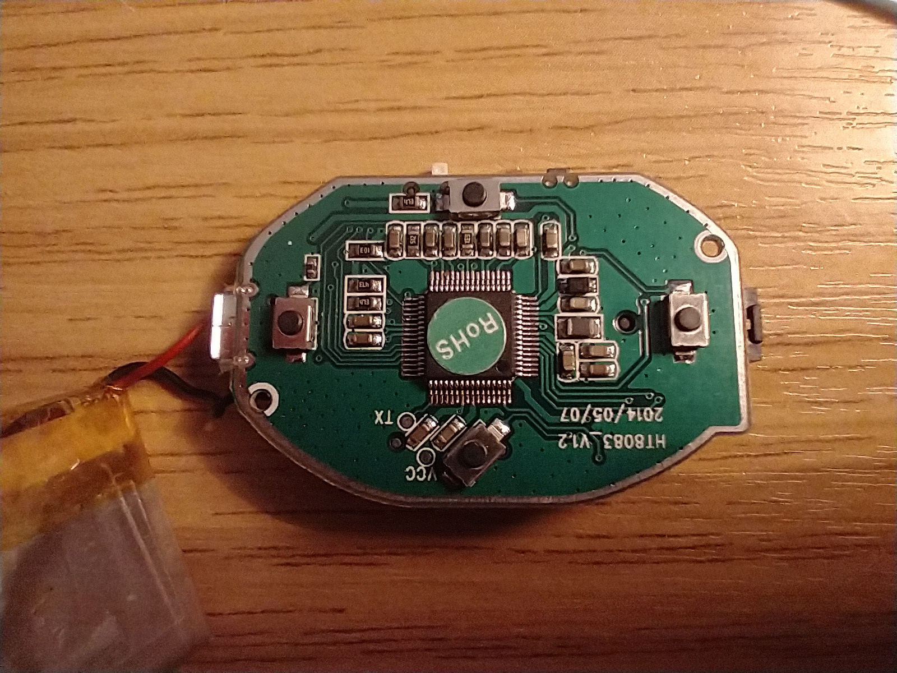
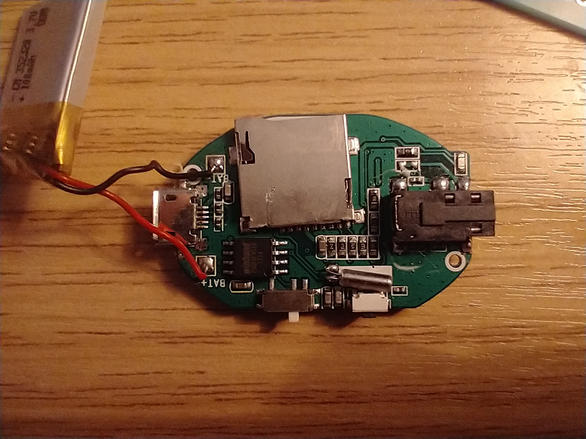
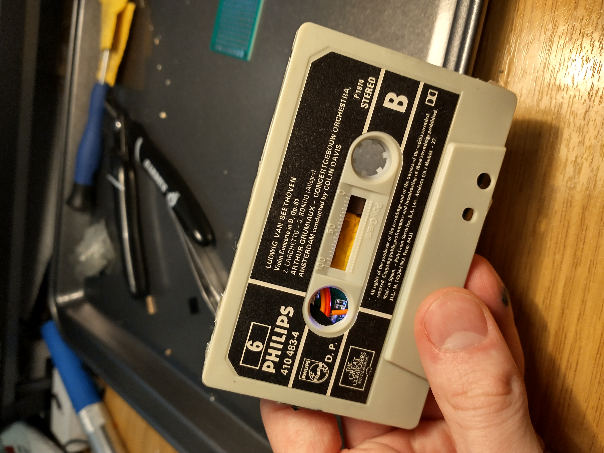
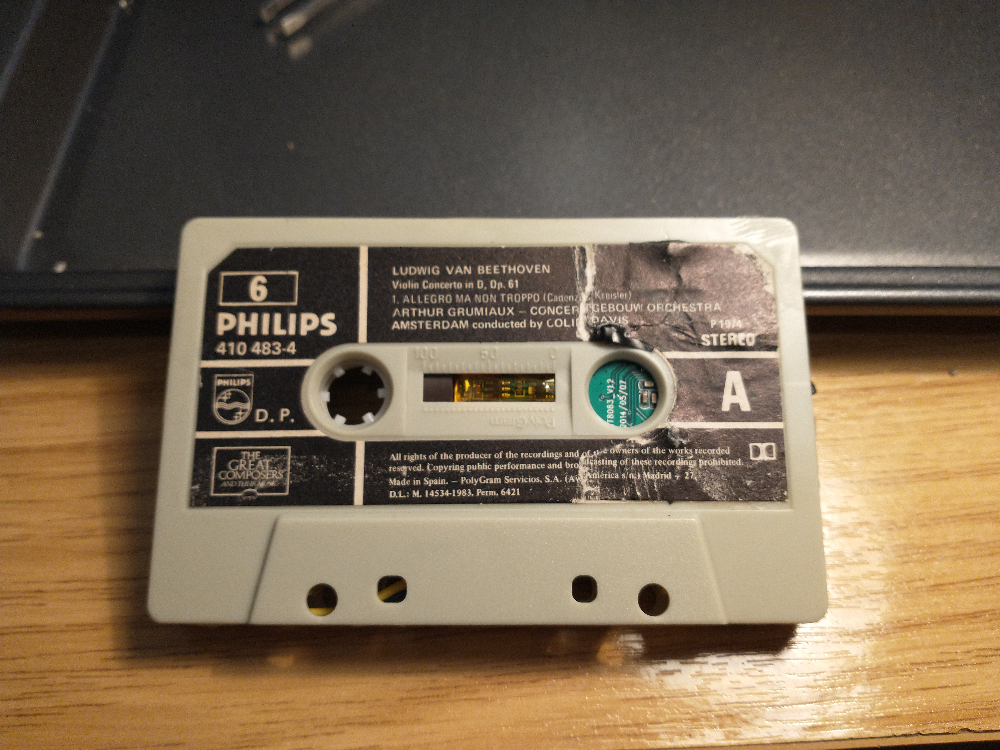
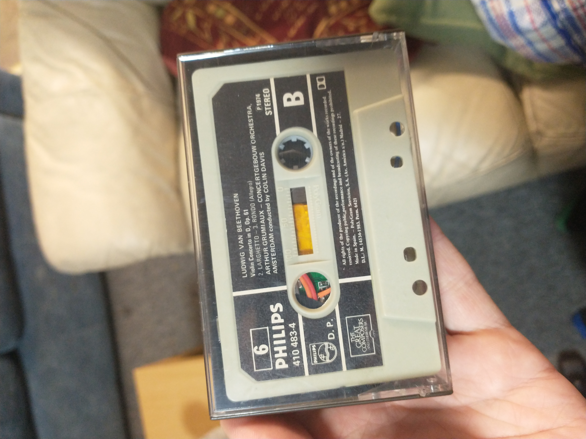
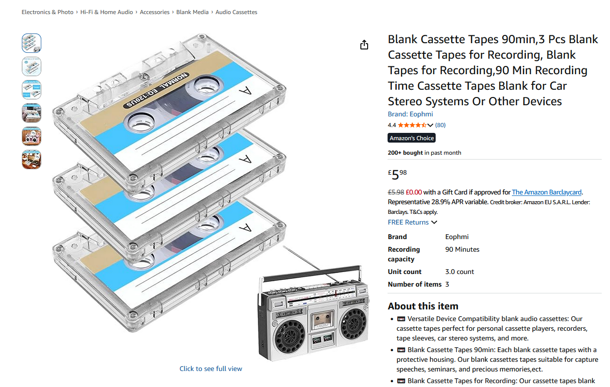

# Project Journal

## Initial Idea

The main idea of the project is to create a stylistic mp3 player that functions as a classic mp3 player, but looks like a retro-style cassette tape.

## First Protoype

### Plan and Design

As far as I can tell, no existing product like this already exists.

The first prototype was a simple proof of concept design, using an existing pocket mp3 player and reorganising the internals to simply fit inside an existing cassette tape.

mp3 player core front:

mp3 player core back:

## Results

The main PCB was placed in the centre-left of the cassette (with the charging port accessable from the top), and the battery placed centre-middle with some extra wires soldered to make sure it could reach the main board. The headphone port was also desoldered and moved to the top-right.

prototype final front:

prototype final back:

The cassette also came with a case which was quite a nice addition, and could be included in future iterations.

prototype in case:

Development cost:
- £3 for 3 old cassette tapes
- £0 (~£10 new?) already owned mp3 player pcb
- £0 (negligable) already owned solder and wires
Total: £3

### Reflection

I think the idea works well and can be iterated upon, the ability to see some of the circuitry is quite a nice addition and I feel adds to the aesthetic. The case is also a nice addition and adds both durability as well as a more fun user experience.

This design had a few major issues however, the sd card is not accessable without taking apart the whole case (which could be a feature if you wanted to make the product with a hard coded set of songs), the cassette is an already existing an quite old product which took a fair amount of effort to disassemble and reassemble, and the circuitry is generally quite fragile and feels like the headphone socket could fall out with too much force.

Improvements also include making buttons easier/more reliable to press, and the use of an sd card would make updating songs on the product difficult for many people not super tech-inclined. The songs are also stuck on shuffle, which is currently meant to be a feature, but future iterations could include the ability to change playlists or songs and see what you're playing (maybe with an E-Paper display?), however I also feel this would impact the retro asthetic and increase build cost and complexity quite a lot.

The main improvements to complete in the next iteration is to use custom designed cassette cases and maybe also a custom pcb for the whole system, instead of using existing products which could change over time and are also time consuming and difficult to repurpose.

## Second Prototype

### Research

Some better existing cassette casings exist like the following:

However would still need modification to have the pcb be effectively placed inside, as well as wastage of the internal parts such as the tape. The clear casing design could be a consideration for future iterations or versions however.

[This website](https://brainbound.blog/cassette-size-dimensions-guide) states the cassettes are standardised to 101.6 mm x 63.5 mm x 12.7 mm (4 x 2.5 x 0.5 inches). I measured the size of one of old the cassettes I bought which seems to match these dimensions quite accurately, therefore these measurements are probably reliable. Making the mp3 player fit standards would be veru useful to allow it to fit with existing products on the market (such as cases and holders). 

[This website](https://vamosarema.com/) provides some potentially useful diagrams for modelling. Which when opening again seems to actually just be an advertising website.

Some useful diagrams I have found are in Images/Diagrams, but I couldn't find any full schematics/diagrams for the whole compact cassette design. I think the best method for modelling the cassette would be to use an existing 3d model and ensuring the measurements are correct.

Final Improvements:
- Use custom cassette case
- Use custom mp3 player core
- Ensure all ports and buttons are easily accessable

For the custom cassette case, it can be simply 3d printed, at least for this prototype. I can probably use [JLC3DP](https://jlc3dp.com/) as I would most likely be using their similar service, [JLCPCB](https://jlcpcb.com/), for PCB prototyping. 

For the mp3 player core, a custom design with minimal hand soldering seems like the best idea. Looking at existing designs, [bumpy](https://www.mattkeeter.com/projects/bumpy/) is the first one I looked at, which seems to be quite effective. It has a small form factor, is able to have songs added via usb, and is reachargable (lasting for 24h off one charge apparently). The position of the components would not work in its current configuration, but with the schematics it would most likely be pretty easy to reorder components and resize to fit the case. The leds also are a very nice addition, but may not fit the retro aesthetic. Some changes to the design of them might make it work very well though (using orange leds? putting them through some diffusion filter through the case?). It is a very expensive system however, and costs roughly £70 for one decive without the casing.

Thinking about the custom PCB design, lots of components are surface mounted and therefore quite hard to solder at home, needing JLCPCB or whichever other manufacturer to mount them for me. The bumpy prototype used (oshpark)[https://oshpark.com/] which might be a good option. Looking at their (parts library)[https://jlcpcb.com/parts] they seem to have the ATMmega32U4, but not the VS1003.

Looking at other designs, (this project)[https://circuitdigest.com/electronic-circuits/diy-mp3-player-circuit-diagram] seems quite adaptable and compact, and much simpler to adapt than the bumpy design as less is being designed in-house. The main component, the (GPD2846 MP3 player Module)[https://www.aliexpress.com/s/wiki-ssr/article/gpd2846-mp3-player-module], seems to be pretty effective. Maufactured by GeneralPlus, I can't seem to find any official datasheets or documentation for it on their website but lots of unofficial info (here)[https://www.circuits-diy.com/mp3-player-circuit-using-gpd2846-module/] and (here)[https://www.alldatasheet.com/datasheet-pdf/view/1132627/etc2/gpd2846a.html] seems to be hopefully sufficient. Building a pcb around this should be more straight forward, but would require some hand soldering to connect our custom PCB to the GPD2846 board. 

All the projects using the GPD2846 seem to use the KIA78R33PI, a Terminal Low Dropout Voltage Regulator, which converts the 9V battery to a 3.3V input. This would not likely be neccessary for us, but a rechargable 3.3V abttery system should be used instead. The (Adafruit Micro-Lipo Charger)[https://www.adafruit.com/product/4410] might be a good solution for this, allowing for simple usb-c charging, li-ion battery connection and 5V output (accepted by the GPD2846).

https://esp32io.com/tutorials/esp32-mp3-player

## Production Version